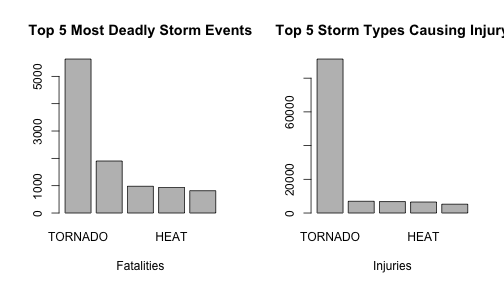

# Economic and population health effects of storm events in the USA

## Synopsis

This report contains an analysis of storm data for the United States of America (collected by NOAA) between 1950 and 2011. The report presents the top five most important types of storms in the USA both in terms of population health and economic impact.

## Data processing

### Read data

```r
library('knitr')
#rm(list=ls(all=TRUE))
setwd('~/Documents/repdata_2/')
#stormdata <- read.csv(
#  bzfile('~/Downloads/repdata-data-StormData.csv.bz2'), 
#  as.is=TRUE
#)
```


### Prepare data for analysing the impact on population health

Impact on population health is collected in the dataset for fatalities and injuries. The following R code aggregates these two types of population health impacts by storm type and merges them together into a data.frame for reporting results. The top five impacts for fatalities and injuries are stored in the R objects `{r} ph1` and `{r} ph2`.


```r
pophealth.fatalities <- aggregate(stormdata$FATALITIES, 
  by=list(stormdata$EVTYPE), 
  FUN=sum
)
pophealth.injuries <- aggregate(stormdata$INJURIES, 
  by=list(stormdata$EVTYPE), 
  FUN=sum
)

names(pophealth.fatalities) <- c('Storm', 'Fatalities')
names(pophealth.injuries) <- c('Storm', 'Injuries')

# Merge the data by event type and subset top by event types
ph <- merge(pophealth.fatalities, pophealth.injuries)
ph1 <- ph[order(-ph$Fatalities),][1:5,]
ph2 <- ph[order(-ph$Injuries),][1:5,]
```

### Prepare data for analysing economy impact of storms

Impact on the economy is collected in the dataset for property and crop damage. Before aggregating this damage by storm type, the data must be transformed into common units as in the following R code.


```r
stormdata$pdmg_mult <- 1
stormdata$pdmg_mult[which(toupper(stormdata$PROPDMGEXP) == 'B')] <- 1000000000
stormdata$pdmg_mult[which(toupper(stormdata$PROPDMGEXP) == 'M')] <- 1000000
stormdata$pdmg_mult[which(toupper(stormdata$PROPDMGEXP) == 'K')] <- 1000
stormdata$crop_mult <- 1
stormdata$crop_mult[which(toupper(stormdata$CROPDMGEXP) == 'B')] <- 1000000000
stormdata$crop_mult[which(toupper(stormdata$CROPDMGEXP) == 'M')] <- 1000000
stormdata$crop_mult[which(toupper(stormdata$CROPDMGEXP) == 'K')] <- 1000
```

The following R code aggregates these two types of economy impacts by storm type and merges them together into a data.frame for reporting results. The top five impacts for fatalities and injuries are stored in the R objects `{r} ec1` and `{r} ec2`. A third R object `{r} ec3` contains the total economic impact of the two types of damage. 


```r
economy.property <- aggregate(
  (stormdata$PROPDMG*stormdata$pdmg_mult)/1000000, 
  by=list(stormdata$EVTYPE), 
  FUN=sum
)
economy.crop <- aggregate(
  (stormdata$CROPDMG*stormdata$crop_mult)/1000000, 
  by=list(stormdata$EVTYPE), 
  FUN=sum
)
  
names(economy.property) <- c('Storm', 'PropertyDamage')
names(economy.crop) <- c('Storm', 'CropDamage')

# Merge the data by event type and subset top by event types
ec <- merge(economy.property, economy.crop)
ec$TotalDamage <- ec$PropertyDamage + ec$CropDamage
ec1 <- ec[order(-ec$PropertyDamage),][1:5,]
ec2 <- ec[order(-ec$CropDamage),][1:5,]
ec3 <- ec[order(-ec$TotalDamage),][1:5,]
```

## Results

### Storm events and population health

The top five storm events in terms of fatalities:


```r
print(ph1)
```

```
##              Storm Fatalities Injuries
## 834        TORNADO       5633    91346
## 130 EXCESSIVE HEAT       1903     6525
## 153    FLASH FLOOD        978     1777
## 275           HEAT        937     2100
## 464      LIGHTNING        816     5230
```

The top five storm events in terms of injuries:


```r
print(ph2)
```

```
##              Storm Fatalities Injuries
## 834        TORNADO       5633    91346
## 856      TSTM WIND        504     6957
## 170          FLOOD        470     6789
## 130 EXCESSIVE HEAT       1903     6525
## 464      LIGHTNING        816     5230
```

Summary of storm impacts on population health. Both fatalities and injuries considered:


```r
par(mfrow=c(1,2))
barplot(
  ph1$Fatalities, 
  names.arg=ph1$Storm, 
  xlab='Fatalities', 
  main='Top 5 Most Deadly Storm Events'
)
barplot(
  ph2$Injuries, 
  names.arg=ph1$Storm,
  xlab='Injuries',
  main='Top 5 Storm Types Causing Injury'
)
```

 

### Storm events and the economy

There are two main economic impacts of storms in the USA, namely property and crop damage. 

The top 5 storm types by property damage are:

```r
print(ec1)
```

```
##                 Storm PropertyDamage CropDamage TotalDamage
## 170             FLOOD      144657.71  5661.9685   150319.68
## 411 HURRICANE/TYPHOON       69305.84  2607.8728    71913.71
## 834           TORNADO       56937.16   414.9533    57352.11
## 670       STORM SURGE       43323.54     0.0050    43323.54
## 153       FLASH FLOOD       16140.81  1421.3171    17562.13
```

The top 5 storm types in terms of crop damage are:

```r
print(ec2)
```

```
##           Storm PropertyDamage CropDamage TotalDamage
## 95      DROUGHT       1046.106  13972.566   15018.672
## 170       FLOOD     144657.710   5661.968  150319.678
## 590 RIVER FLOOD       5118.945   5029.459   10148.405
## 427   ICE STORM       3944.928   5022.114    8967.041
## 244        HAIL      15732.267   3025.954   18758.222
```

When combined together, the types of storm events that cause the most negative impact on the USA economy are:

```r
print(ec3)
```

```
##                 Storm PropertyDamage CropDamage TotalDamage
## 170             FLOOD      144657.71  5661.9685   150319.68
## 411 HURRICANE/TYPHOON       69305.84  2607.8728    71913.71
## 834           TORNADO       56937.16   414.9533    57352.11
## 670       STORM SURGE       43323.54     0.0050    43323.54
## 244              HAIL       15732.27  3025.9545    18758.22
```


The type of storm that causes the most total damage to the economy in the USA is FLOOD, followed by HURRICANE/TYPHOON.
